# TP_GPG

## 1. GPG et le chiffrement symétrique  

### 1.1. Vérifications  

Exécutez la commande suivante pour vérifier la version de **GnuPG** installée :  

#### **Commande :**
```sh
gpg --version
```

#### 📌 **Output :**  
```sh
gpg (GnuPG) 2.2.27
libgcrypt 1.9.4
Copyright (C) 2021 Free Software Foundation, Inc.
License GNU GPL-3.0-or-later <https://gnu.org/licenses/gpl.html>

This is free software: you are free to change and redistribute it.
There is NO WARRANTY, to the extent permitted by law.

Home: /home/user/.gnupg

Supported algorithms:
  - **Pubkey:** RSA, ELG, DSA, ECDH, ECDSA, EDDSA
  - **Cipher:** IDEA, 3DES, CAST5, BLOWFISH, AES, AES192, AES256, TWOFISH, CAMELLIA128, CAMELLIA192, CAMELLIA256
  - **Hash:** SHA1, RIPEMD160, SHA256, SHA384, SHA512, SHA224
  - **Compression:** Uncompressed, ZIP, ZLIB, BZIP2
```
### 1.2. Chiffrement
Exécutez la commande suivante pour créer un fichier texte nommé zakaria_elguazzar.txt contentant le message "Hey how are you ayoub".
#### **Commande :**
```sh
echo "Hey how are you ayoub">>zakaria_elguazzar.txt
```
Exécutez la commande suivante pour crypter le fichier contenant du texte nommé "zakaria_elguazzar.txt".
#### **Commande :**

```sh
gpg --symmetric --armour zakaria_elguazzar.txt
```
Choisir une passphrase. Elle vous servira à chaque 
fois que vous aurez à utiliser votre clé privée.
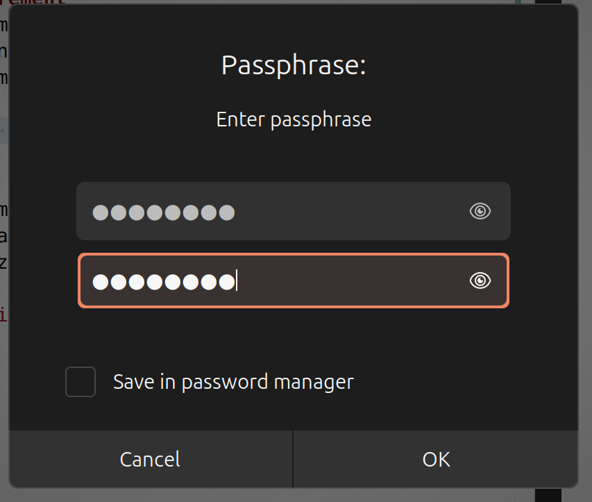

#### 📌 **Output :**
```sh
gpg: directory '/home/user/.gnupg' created 
gpg: keybox '/home/user/.gnupg/pubring.kbx' created
```
Avec la création du fichier zakaria_elguazzar.txt.asc

On peut aussi créer un fichier crypté en binaire. la commande correspondante est :

#### **Commande :**
```sh
gpg --symmetric  zakaria_elguazzar.txt
```
Ceci créera un fichier binaire " mon_message.txt.gpg" contenant le fichier binaire chiffré.
### 1.3. Déchiffrement
Pour décrypter,il suffit d'utiliser:
#### **Commande :**
```sh
gpg --decrypt mon_message.txt.asc
```
#### 📌 **Output :**
```sh
gpg: AES256.CFB encrypted data
gpg: encrypted with 1 passphrase
Hey how are you ayoub
```
on doit faire quelques étapes:
1. Envoyez un fichier crypté à votre voisin , en mettant en copie l'adresse e-mail de votre professeur et en utilisant « Fichier crypté » comme objet de l'e-mail. 
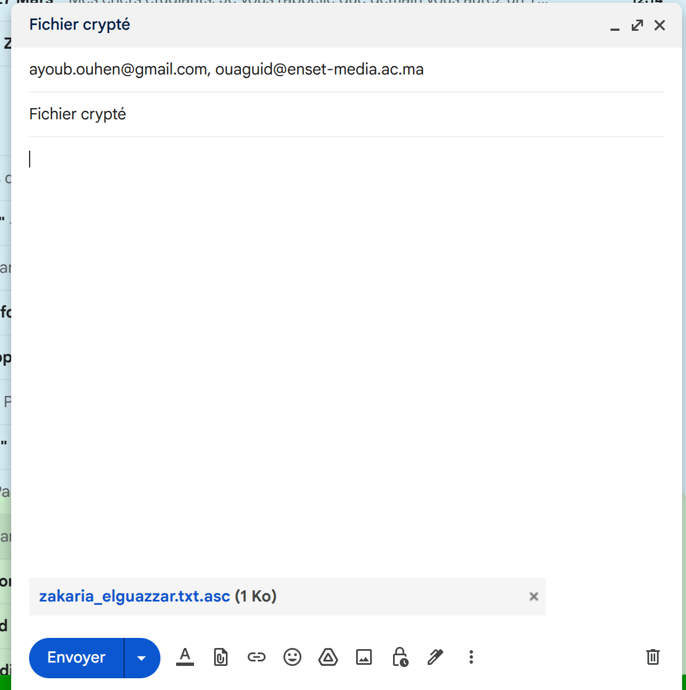
2. Essayez de décrypter le fichier en utilisant une clé erronée (une seule lettre de différence), que se passe-t-il(**Réponse** : le décryptage va échoué ou le décryptage va etre erronéé) ? 
3. À votre avis, que peut-on faire pour déchiffrer le fichier si on a perdu la clé?(**Réponse** : Vérifier si la clé privée est toujours sur votre système car GPG stocke les clés dans   '/home/user/.gnupg/pubring.kbx')
## 2. Gestion des clés publique / privée 
 
### 2.1. Création des clés

Pour créer votre propre clé publique/clé privée,  il  faut 
utiliser la commande.
#### **Commande :**
```sh
gpg --full-gen-key
```
Les étapes à suivre :
• Créez vos clés en acceptant les choix par défaut, sauf pour la durée de validité de 
vos clés (30 jours) 
• Pour  notre  TP,  veuillez  saisir  uniquement  les  initiales  de  votre  prénom  et  de  votre 
nom,  plutôt  que  vos  noms  complets,  et  indiquez  «  ENSET  Training»  dans  le  champ 
commentaire. Optez pour une adresse email fictive pour le test, par exemple 
NUMORDREtest2025@SDIA.ma (ou NUMORDREtest2025@ICCN.ma selon votre 
filiale).  Toutefois,  dans  une  situation  réelle,  il  est  crucial  de  renseigner  votre  nom 
complet  et  une  adresse  email  régulièrement  consultée.  Notez  que  la  clé  créée  sera 
partagée sur un serveur de clés public, il est donc préférable d'utiliser des informations 
fictives pour ce TP. 
• Choisissez une « passphrase » sûre et dont vous vous rappellerez... Elle vous servira à 
chaque fois que vous aurez à utiliser votre clé privée.

#### 📌 **Output :**
```sh
gpg (GnuPG) 2.4.4; Copyright (C) 2024 g10 Code GmbH
This is free software: you are free to change and redistribute it.
There is NO WARRANTY, to the extent permitted by law.

Please select what kind of key you want:
   (1) RSA and RSA
   (2) DSA and Elgamal
   (3) DSA (sign only)
   (4) RSA (sign only)
   (9) ECC (sign and encrypt) *default*
  (10) ECC (sign only)
  (14) Existing key from card
Your selection? 9
Please select which elliptic curve you want:
   (1) Curve 25519 *default*
   (4) NIST P-384
   (6) Brainpool P-256
Your selection? 1
Please specify how long the key should be valid.
         0 = key does not expire
      <n>  = key expires in n days
      <n>w = key expires in n weeks
      <n>m = key expires in n months
      <n>y = key expires in n years
Key is valid for? (0) 30
Key expires at Fri 25 Apr 2025 06:18:12 PM +01
Is this correct? (y/N) y

GnuPG needs to construct a user ID to identify your key.

Real name: Zak Elguaz
Email address: 10test2025@SDIA.ma
Comment: ENSET Training
You selected this USER-ID:
    "Zak Elguaz (ENSET Training) <10test2025@SDIA.ma>"

Change (N)ame, (C)omment, (E)mail or (O)kay/(Q)uit? O
We need to generate a lot of random bytes. It is a good idea to perform
some other action (type on the keyboard, move the mouse, utilize the
disks) during the prime generation; this gives the random number
generator a better chance to gain enough entropy.
We need to generate a lot of random bytes. It is a good idea to perform
some other action (type on the keyboard, move the mouse, utilize the
disks) during the prime generation; this gives the random number
generator a better chance to gain enough entropy.
gpg: directory '/home/zakaria-elguazzar/.gnupg/openpgp-revocs.d' created
gpg: revocation certificate stored as '/home/zakaria-elguazzar/.gnupg/openpgp-revocs.d/89115F4A34DE823C29DEACABA719905AA6A960F0.rev'
public and secret key created and signed.

pub   ed25519 2025-03-26 [SC] [expires: 2025-04-25]
      89115F4A34DE823C29DEACABA719905AA6A960F0
uid                      Zak Elguaz (ENSET Training) <10test2025@SDIA.ma>
sub   cv25519 2025-03-26 [E] [expires: 2025-04-25]
```
Pour vérifier que les clés ont bien été créées, utilisez la commande.
#### **Commande :**
```sh
$ gpg --list-keys 
```
 
#### 📌 **Output :** 
```sh
gpg: checking the trustdb
gpg: marginals needed: 3  completes needed: 1  trust model: pgp
gpg: depth: 0  valid:   1  signed:   0  trust: 0-, 0q, 0n, 0m, 0f, 1u
gpg: next trustdb check due at 2025-04-25
/home/user/.gnupg/pubring.kbx 
----------------------------- 
pub   rsa3072/FF3FF5FE7884B4D3 2024-03-03 [SC] [expires: 2026-03-03] 
      59CB8EFB55E865BE891940C419C1C7EE01057FC9 
uid           [ultimate] monNom monPrenom <mon_email@gmail.com> 
sub   rsa3072 2024-03-03 [E] [expires: 2026-03-03] 
```
### 2.2. Certificat de révocation
Un certificat de révocation pourra servir dans le cas où vous perdez votre clé privée, ou bien vous avez perdu votre passphrase, ou on vous a volé votre ordinateur.

Pour créer un certificat de révocation, il faut faire : 

#### **Commande :**
```sh
gpg --output revoke.txt --gen-revoke 10test2025@SDIA.ma 
```
#### 📌 **Output :** 
```sh
sec  ed25519/A719905AA6A960F0 2025-03-26 Zak Elguaz (ENSET Training) <10test2025@SDIA.ma>

Create a revocation certificate for this key? (y/N) y
Please select the reason for the revocation:
  0 = No reason specified
  1 = Key has been compromised
  2 = Key is superseded
  3 = Key is no longer used
  Q = Cancel
(Probably you want to select 1 here)
Your decision? 0
Enter an optional description; end it with an empty line:
> No reason specified for the generation of the revocation certificate
> 
Reason for revocation: No reason specified
No reason specified for the generation of the revocation certificate
Is this okay? (y/N) y
ASCII armored output forced.
Revocation certificate created.

Please move it to a medium which you can hide away; if Mallory gets
access to this certificate he can use it to make your key unusable.
It is smart to print this certificate and store it away, just in case
your media become unreadable.  But have some caution:  The print system of
your machine might store the data and make it available to others!
```
We need to open the secret key with pass
on doit ouvrir la clé secrete avec le passphrase avant de créer le certificat de révocation


### 2.3. Partage des clés 
 
#### 2.3.1.  À la main

Pour envoyer votre clé publique à quelqu'un, vous pouvez commencer par l'exporter avec la 
commande :

#### **Commande :**
```sh
$ gpg --output cle.asc --export --armour uid
```
1. Échangez vos clés avec votre voisin (par e-mail ayant pour objet «Partage des clés » comme objet, tout en mettant votre professeur en copie) en exportant la vôtre et important la sienne.
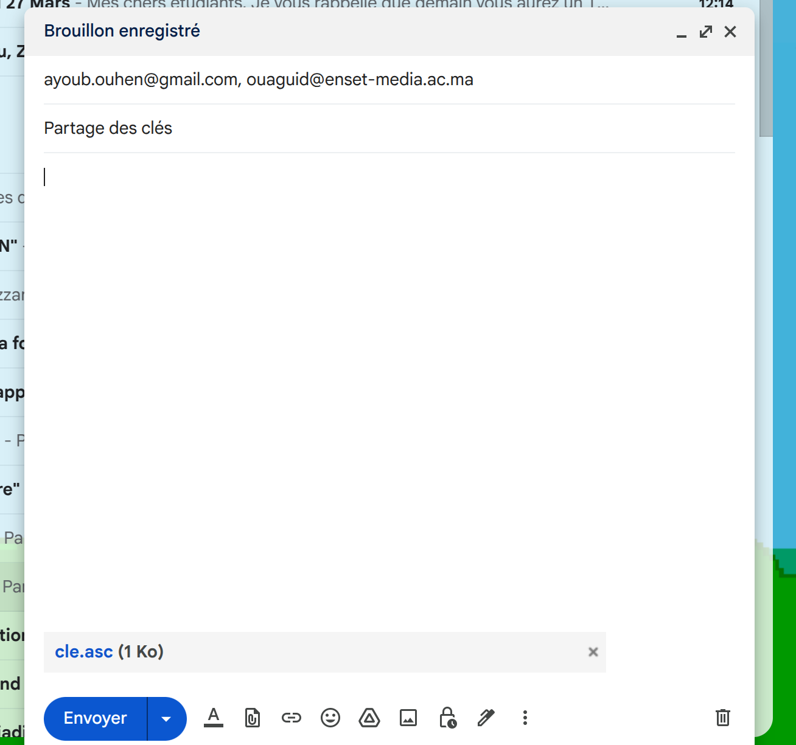
2. Vérifiez qu'une nouvelle clé apparaît dans la liste affichée par :
#### **Commande :**
```sh
$ gpg --list-keys
```
#### 📌 **Output :**
```sh
/home/zakaria-elguazzar/.gnupg/pubring.kbx
------------------------------------------
pub   ed25519 2025-03-26 [SC] [expires: 2025-04-25]
      89115F4A34DE823C29DEACABA719905AA6A960F0
uid           [ultimate] Zak Elguaz (ENSET Training) <10test2025@SDIA.ma>
sub   cv25519 2025-03-26 [E] [expires: 2025-04-25]

pub   rsa3072 2025-03-26 [SC] [expires: 2025-04-25]
      41E5C55D7D2DF2B35524A722CE1C891D77ECD6EE
uid           [ unknown] ayouhen (ENSET Training) <25test2025@SDIA.ma>
sub   rsa3072 2025-03-26 [E] [expires: 2025-04-25]
```
#### 2.3.2.  Avec un annuaire
Pour  partager  les  clés  à  grande  échelle,  on  utilise  plutôt  un  serveur  de  clés.  Il  existe  de 
nombreux serveurs publics, comme par exemple celui du Ubuntu ou MIT. Ces serveurs de clés 
sont tous interconnectés, et il est  pour  cette raison impossible de pirater  ces annuaires...  (Il 
faudrait pour ceci arriver à tous les pirater en même temps !)
```sh
gpg --keyserver https://keyserver.ubuntu.com/ --send-keys A719905AA6A960F0
```
Consultant https://keyserver.ubuntu.com/ 
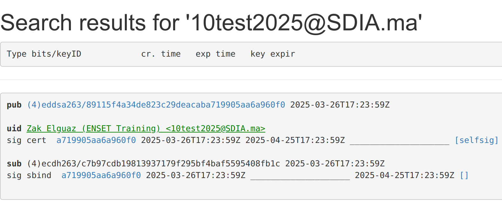

#### 2.3.3. Vérifier et contre-signer une clé 
Chaque clé possède une « empreinte digitale ». Quand vous récupérez une clé, il est important 
de  vérifier  cette  empreinte...  Cette  empreinte  est  suffisamment  petite  pour  être  facilement 
transmissible (carte de visite etc.) 
 
Par exemple : 59CB 8EFB 55E8 65BE 8919  40C4 19C1 C7EE 0205 7FC9 
 
Pour trouver l'empreinte d'une clé, vous pouvez utiliser:
#### **Commande :**
```sh
 $ gpg --fingerprint 
```
#### 📌 **Output :**
```sh
pub   ed25519 2025-03-26 [SC] [expires: 2025-04-25]
      8911 5F4A 34DE 823C 29DE  ACAB A719 905A A6A9 60F0
uid           [ultimate] Zak Elguaz (ENSET Training) <10test2025@SDIA.ma>
sub   cv25519 2025-03-26 [E] [expires: 2025-04-25]

pub   rsa3072 2025-03-26 [SC] [expires: 2025-04-25]
      41E5 C55D 7D2D F2B3 5524  A722 CE1C 891D 77EC D6EE
uid           [ unknown] ayouhen (ENSET Training) <25test2025@SDIA.ma>
sub   rsa3072 2025-03-26 [E] [expires: 2025-04-25]
```

Une fois que vous avez vérifié une clé, vous pouvez l'authentifier pour dire « je fais confiance à 
cette clé... » On parle de contre-signature. La commande est simplement : 
 
$ gpg --sign-key uid 
 
où "uid" est l'identité de la clé à authentifier. 

#### **Commande :**
```sh
gpg --default-key A719905AA6A960F0 --sign-key CE1C891D77ECD6EE
```
#### 📌 **Output :**
```sh
pub  rsa3072/CE1C891D77ECD6EE
     created: 2025-03-26  expires: 2025-04-25  usage: SC  
     trust: unknown       validity: unknown
sub  rsa3072/846C3C168EE8470D
     created: 2025-03-26  expires: 2025-04-25  usage: E   
[ unknown] (1). ayouhen (ENSET Training) <25test2025@SDIA.ma>

gpg: using "A719905AA6A960F0" as default secret key for signing

pub  rsa3072/CE1C891D77ECD6EE
     created: 2025-03-26  expires: 2025-04-25  usage: SC  
     trust: unknown       validity: unknown
 Primary key fingerprint: 41E5 C55D 7D2D F2B3 5524  A722 CE1C 891D 77EC D6EE

     ayouhen (ENSET Training) <25test2025@SDIA.ma>

This key is due to expire on 2025-04-25.
Are you sure that you want to sign this key with your
key "Zak Elguaz (ENSET Training) <10test2025@SDIA.ma>" (A719905AA6A960F0)

Really sign? (y/N) y
```

on doit entrer le passphrase.
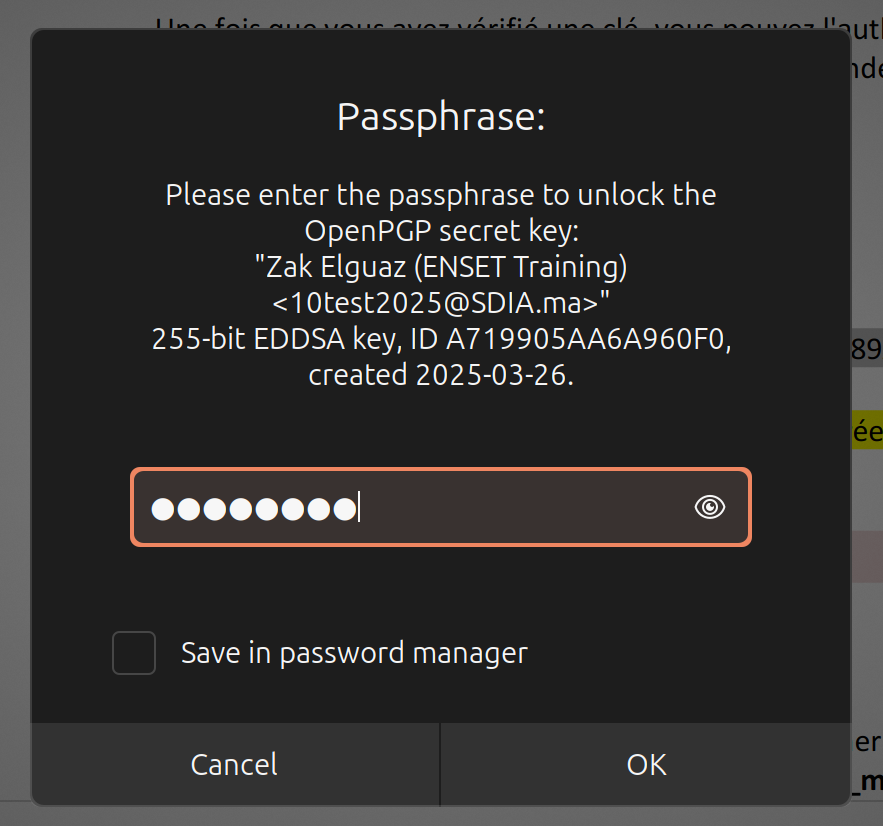

## 3.Signature Numérique 
 
### 3.1. Signature 
1. créer un fichier texte 
#### **Commande :**
```sh
echo "Hey How are you guys">>new_message.txt
```
2. signer le fichier avec la clé privée
#### **Commande :**
```sh
gpg --clearsign new_message.txt
```
on doit entrer le passphrase pour signer.


## 3.2. Vérification d’un fichier signé 

Pour vérifier un fichier signé, on utilise
#### **Commande :**
```sh
gpg --verify new_message.txt.asc
```
#### 📌 **Output :**
```sh
gpg: Signature made Wed 26 Mar 2025 11:37:03 PM +00
gpg:                using EDDSA key 89115F4A34DE823C29DEACABA719905AA6A960F0
gpg: Good signature from "Zak Elguaz (ENSET Training) <10test2025@SDIA.ma>" [ultimate]
gpg: WARNING: not a detached signature; file 'new_message.txt' was NOT verified!
```
1. Envoyez à votre voisin un document signé de votre part (en mettant, bien évidemment, le  mail  de  votre  professeur  en  copie  avec  « Vérification  signature  numérique »  comme objet dudit mail)
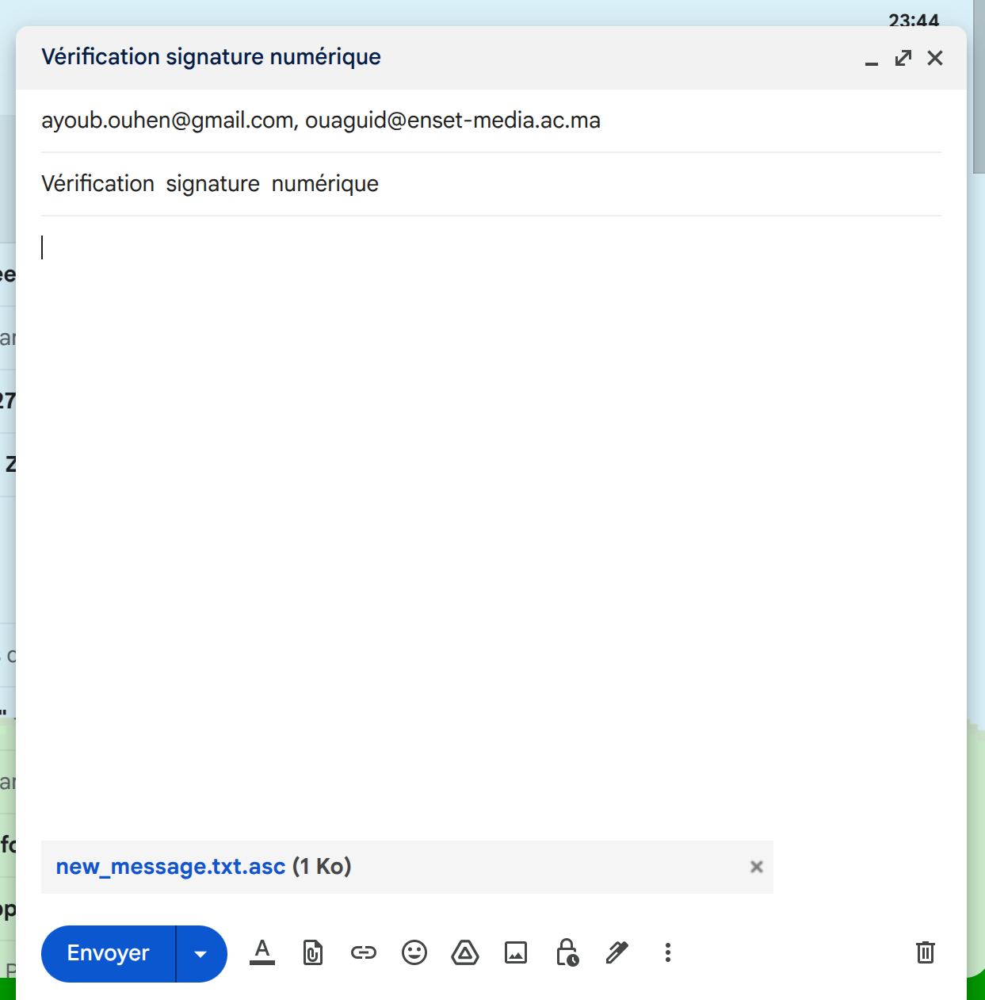

2. Vérifiez la signature d'un document que votre voisin vous a envoyé via email et répondez au précédent mail pour informer votre voisin du résultat de votre vérification, n’oublier pas de mettre le mail de votre professeur en copie.
#### **Commande :**
```sh
gpg --verify myMessage.txt.asc
```
#### 📌 **Output :**
```sh
gpg: Signature made Wed 26 Mar 2025 11:42:41 PM +00
gpg:                using RSA key 41E5C55D7D2DF2B35524A722CE1C891D77ECD6EE
gpg: Good signature from "ayouhen (ENSET Training) <25test2025@SDIA.ma>" [full]
```
3. Vérifiez la signature d'un document qui a été modifié après signature. Que se passe-t-il ?
#### **Commande :**
```sh
gpg --verify ModifiedmyMessage.txt.asc
```
#### 📌 **Output :**
```sh
gpg: CRC error; 2085B4 - 7496F2
gpg: [don't know]: invalid packet (ctb=66)
gpg: no signature found
gpg: the signature could not be verified.
Please remember that the signature file (.sig or .asc)
should be the first file given on the command line.
```
## 4. Chiffrement des fichiers signés 
 
### 4.1. Chiffrement

#### **Commande :**
```sh
 gpg --encrypt --armour -r CE1C891D77ECD6EE new_message.txt.asc
```
Envoyer le message chiffré à mon voisin.

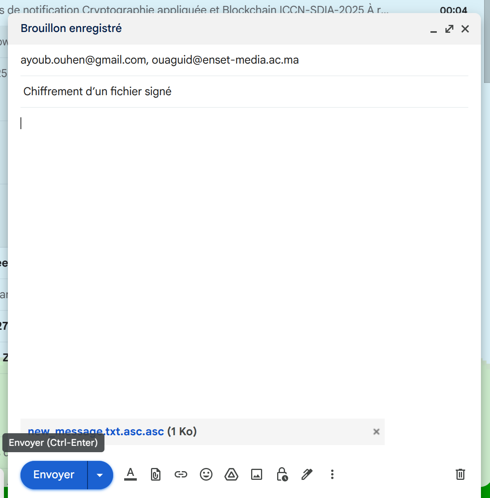

4.2. Déchiffrement

#### **Commande :**
```sh
gpg --decrypt myMessageEncr.txt.asc.asc
```
#### 📌 **Output :**

```sh
gpg: encrypted with cv25519 key, ID F4BAF5595408FB1C, created 2025-03-26
      "Zak Elguaz (ENSET Training) <10test2025@SDIA.ma>"
-----BEGIN PGP SIGNED MESSAGE-----
Hash: SHA512

wat's cruking cuz
-----BEGIN PGP SIGNATURE-----

iQGzBAEBCgAdFiEEQeXFXX0t8rNVJKcizhyJHXfs1u4FAmfkmQwACgkQzhyJHXfs
1u6dEQv/f2UF1JFWzJFwDKyYZNZEPCRCiZR/O5Pku8aE+iQ0edSrRJLfmDZF/6M6
j2bNO9ik1YxcXtxFBPPR2iV22f4LRnhmtR4L7J5Bjc5CAcAUOYvwQhHFw1MketHW
lKM94cWOCkc+wdEeCrpRoVABL+Ug2geDHqdfgun/C41fN8TYTWYtczf+r6LgIvwN
7o/LhRu56Tcr2FdiB4cwvy8g5kpAE/OvkNyi67ppH5x9cvtPa2DP1T6A39clvb5U
V8ppJWNn3tq/jkwm1JKd57SJgDmoZzR3TlcMeukb9SgopXHq/VW2TUa00wc4BGqo
UiHYEQzBikpveaWWqRmbwt3BrSng4IAYZG4V3tIDbaA+8n3UyPp9Vpdq1ll+tZ6L
TXJ+9+VOms5Zc0+SCcW4X60yvnA68/iIFYewBuzDJcbnwpUdhtzM3niDtTzl485G
Xm0Y5VY/JJSUolcKT9pRnwlGT5seZFsMo2IhAvJpcAtvsXB2Udy1sbnxqfLKxV7d
UsFcpwSN
=JEGq
-----END PGP SIGNATURE-----
```

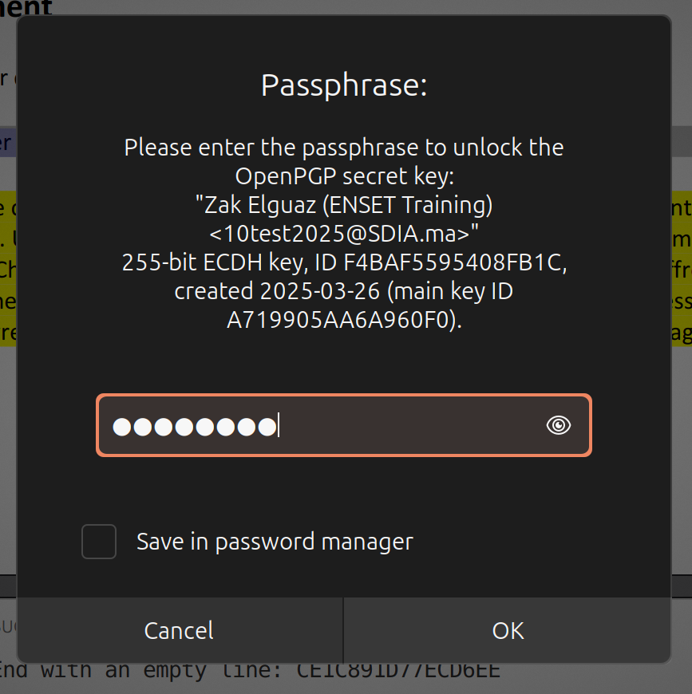

## 5. GPG en graphique sous Windows/Linux/MacOS 
### 5.1 Liste des outils

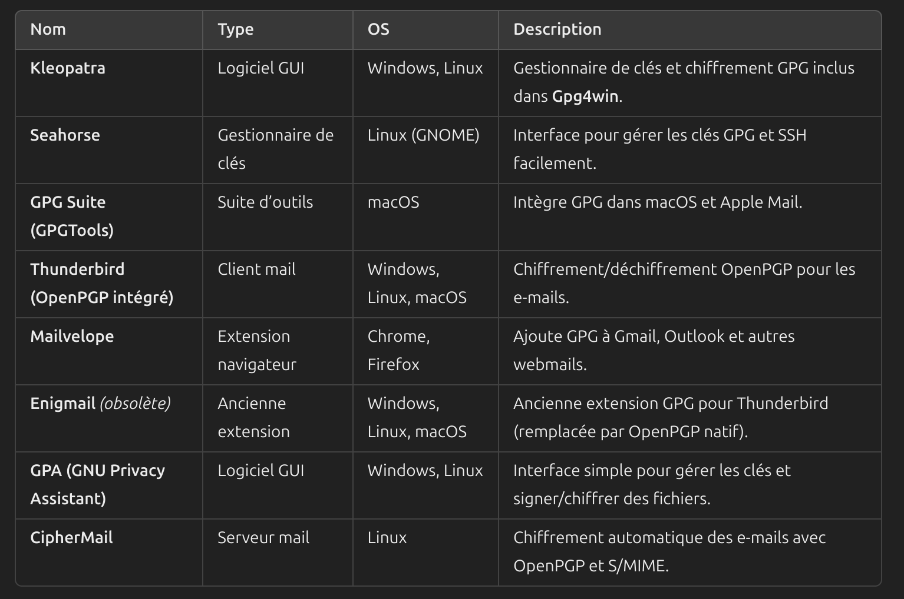

### 5.2 Thunderbird

• Créer une paire de clés privée/publique


• Importer des clés

Reception du clé:


Importation du clé


Choisir un clé

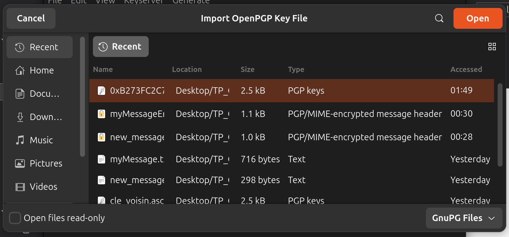

Accepter la vérification

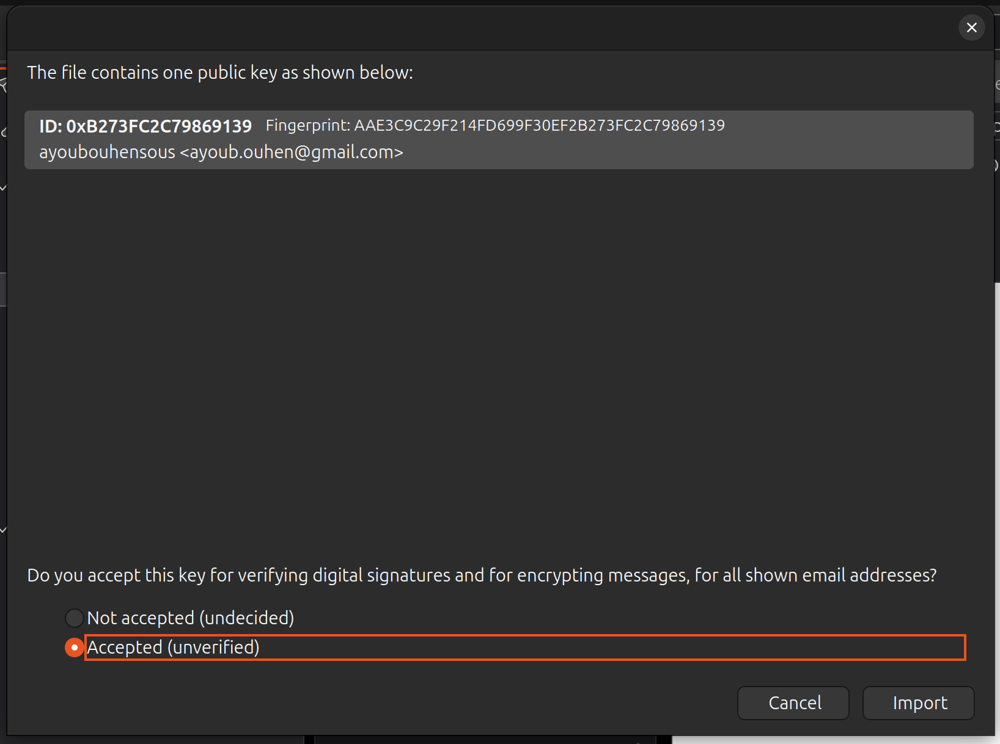

• Chiffrer un message avec la clé publique du destinataire

chiffrement du message automatiquent en choissisant l'email du récipteur qu'on posséde deja son clé publique.

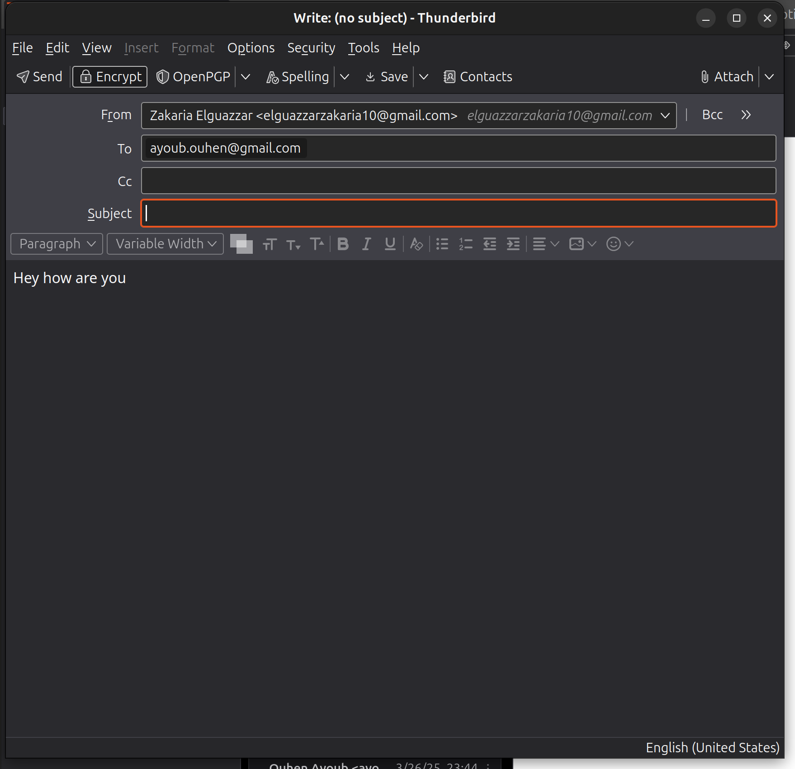

• Utiliser votre clé privée pour déchiffrer un message reçu (que votre voisin a précédemment chiffré avec votre clé publique) et signer un fichier.
l'image indique le message reçu d'Ayoub est chiffré et signé

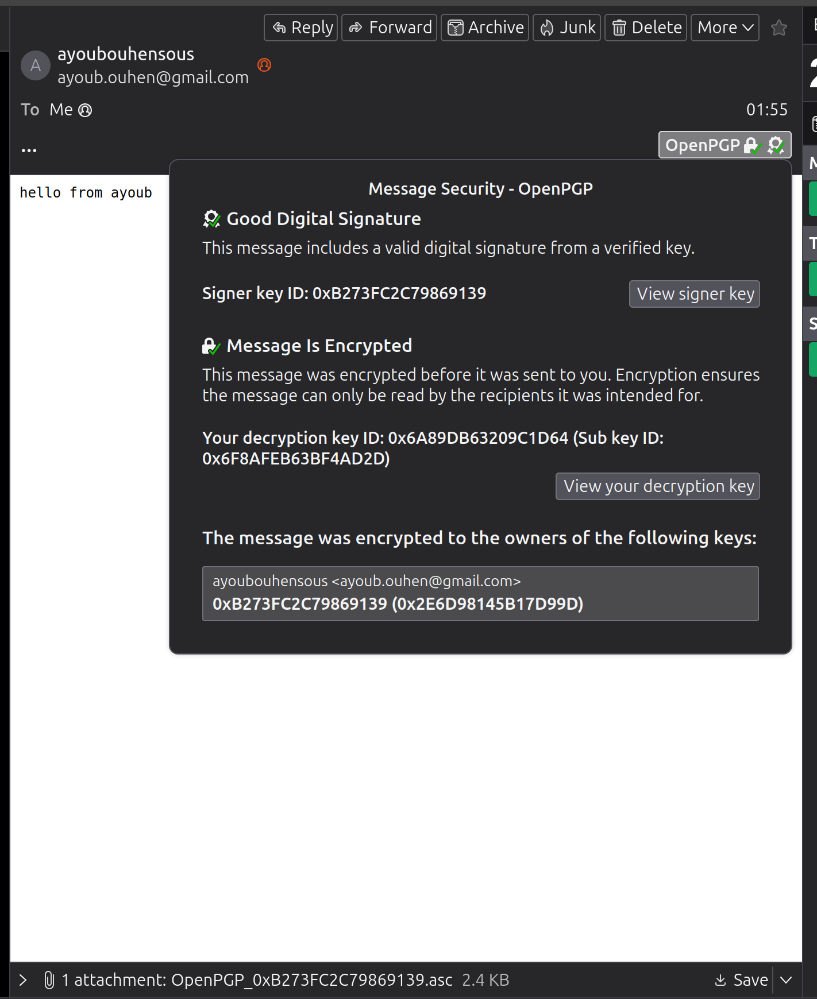


